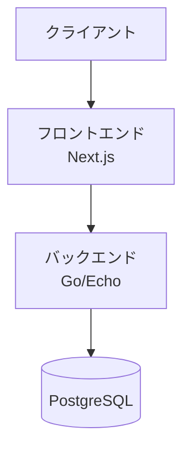

# アーキテクチャ設計

## システム概要

大学入試科目ナビは、以下のコンポーネントで構成されています：



## アーキテクチャの特徴

1. **クリーンアーキテクチャ**

   - ドメイン駆動設計（DDD）の原則に従う
   - 依存関係の方向は内側に向かう
   - ビジネスロジックは外部依存から独立

2. **マイクロサービス準備**

   - 将来的なマイクロサービス化を考慮
   - サービス間の疎結合を維持
   - 明確な責務の分離

3. **セキュリティファースト**
   - 全通信の TLS 暗号化
   - JWT による認証
   - CSRF トークンの使用

## レイヤー構成

### フロントエンド

```
front/
├── src/
│   ├── components/     # UIコンポーネント
│   ├── features/       # 機能モジュール
│   ├── hooks/         # カスタムフック
│   ├── lib/           # ユーティリティ
│   ├── pages/         # ページコンポーネント
│   ├── styles/        # スタイル定義
│   └── types/         # 型定義
```

### バックエンド

```
back/
├── cmd/              # エントリーポイント
├── internal/         # 内部パッケージ
│   ├── domain/      # ドメインモデル
│   ├── usecase/     # ユースケース
│   ├── interfaces/  # インターフェース
│   └── infrastructure/ # インフラ層
└── pkg/             # 公開パッケージ
```

## 技術スタック

### フロントエンド

- Next.js 14
- TypeScript 5
- TailwindCSS
- React Query

### バックエンド

- Go 1.21
- Echo Framework
- GORM
- PostgreSQL

### インフラストラクチャ

- Docker
- Kubernetes (計画中)
- Terraform (計画中)

## パフォーマンス最適化

1. **フロントエンド**

   - 静的生成（SSG）の活用
   - 画像の最適化
   - コード分割

2. **バックエンド**
   - キャッシュ戦略
   - N+1 問題の解決
   - クエリの最適化

## スケーラビリティ

1. **水平スケーリング**

   - ステートレスなアプリケーション設計
   - コンテナ化による柔軟なデプロイ

2. **垂直スケーリング**
   - リソース使用の最適化
   - パフォーマンスチューニング

## 監視と運用

1. **ログ管理**

   - 構造化ログ
   - 集中ログ管理

2. **メトリクス**

   - アプリケーションメトリクス
   - インフラメトリクス

3. **アラート**
   - 異常検知
   - インシデント管理

## 今後の展望

1. **短期目標**

   - パフォーマンス最適化
   - テストカバレッジの向上

2. **中期目標**

   - マイクロサービス化
   - CI/CD の強化

3. **長期目標**
   - グローバル展開対応
   - AI による推薦機能
